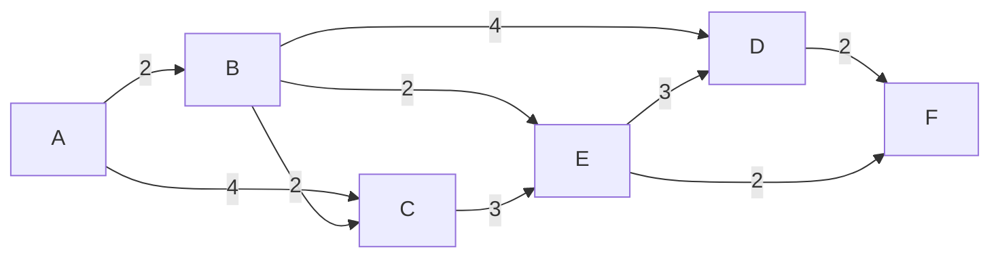

## Overview

Dijkstra's algorithm is a greedy algorithm that solves the single-source shortest path problem for a weighted directed graph with non-negative edge weights. It efficiently computes the shortest distances from a starting vertex to all other vertices in the graph.

<Warning>
  All edge weights must be positive. For graphs with negative edge weights, use the Bellman-Ford algorithm instead.
</Warning>

## How It Works

The algorithm maintains two sets of vertices:

1. **Processed vertices** - vertices for which the shortest distance has been finalized
2. **Unprocessed vertices** - vertices still being evaluated

### Algorithm Steps

<Steps>
  <Step title="Initialize distances">
    Set the distance to the start vertex as 0 and all other distances to infinity. Mark all vertices as unprocessed.
  </Step>
  
  <Step title="Select minimum distance vertex">
    From the unprocessed vertices, select the one with the minimum distance value.
  </Step>
  
  <Step title="Update adjacent vertices">
    For the selected vertex, examine all its unprocessed neighbors. Calculate their distance through the current vertex and update if this path is shorter.
  </Step>
  
  <Step title="Mark as processed">
    Mark the selected vertex as processed (its shortest distance is now final).
  </Step>
  
  <Step title="Repeat">
    Repeat steps 2-4 until all vertices are processed.
  </Step>
</Steps>

## Function Signature

```typescript
function dijkstra(graph: number[][], start: number): number[]
```

### Parameters

<ParamField path="graph" type="number[][]" required>
  A 2D adjacency matrix representing the weighted directed graph. `graph[i][j]` represents the weight of the edge from vertex `i` to vertex `j`. A value of `0` indicates no edge exists.
</ParamField>

<ParamField path="start" type="number" required>
  The index of the starting vertex (0-based).
</ParamField>

### Returns

<ResponseField name="distances" type="number[]">
  An array where `distances[i]` represents the shortest distance from the start vertex to vertex `i`.
</ResponseField>

## Implementation

```typescript dijkstra.ts
const MAX = Number.MAX_SAFE_INTEGER;

/**
 * Finds the (not yet processed) vertex with minimum distance
 */
function minDistanceVertex(distances: number[], processed: boolean[]) {
  // All distances are initialized to MAX so in order for this to be the min value
  // we need to also initialized to MAX
  let minValue = MAX;
  let minIndex = -1;

  for (let i = 0; i < distances.length; i++) {
    if (processed[i] === false && distances[i] <= minValue) {
      minValue = distances[i];
      minIndex = i;
    }
  }

  return minIndex;
}

// This algorithm time complexity can be reduced to O(edges log vertices) with the help of a binary heap.
export function dijkstra(graph: number[][], start: number) {
  const processed = [];
  const distances = [];

  // Initialize distances with MAX for all but the `start` vertex (distance from start vertex to itself is always 0)
  // Set all vertices as not processed
  for (let i = 0; i < graph.length; i++) {
    distances[i] = i === start ? 0 : MAX;
    processed[i] = false;
  }

  for (let i = 0; i < graph.length; i++) {
    // `min` will always be equal to start in the first iteration
    const min = minDistanceVertex(distances, processed);
    // mark the selected vertex as processed
    processed[min] = true;

    for (let v = 0; v < graph.length; v++) {
      if (
        processed[v] === false &&
        // there is an edge from `min` to `v`
        graph[min][v] !== 0 &&
        distances[min] !== MAX &&
        // total distance of path from `start` to `v` through `min` is smaller
        // than the current distance in distances[v]
        distances[min] + graph[min][v] < distances[v]
      ) {
        // in case the shortest path is found, set the new value for the shortest path
        distances[v] = distances[min] + graph[min][v];
      }
    }
  }

  return distances;
}
```

## Complexity Analysis

<CardGroup cols={2}>
  <Card title="Time Complexity" icon="clock">
    **O(V²)** where V is the number of vertices
    
    Can be optimized to **O(E log V)** using a binary heap or priority queue, where E is the number of edges.
  </Card>
  
  <Card title="Space Complexity" icon="memory">
    **O(V)** for storing distances and processed status of all vertices
  </Card>
</CardGroup>

### Complexity Breakdown

- **Outer loop**: Runs V times (once for each vertex)
- **Finding minimum distance vertex**: O(V) in the basic implementation
- **Inner loop**: Checks all V vertices for each selected vertex
- **Overall**: O(V) × O(V) = O(V²)

<Tip>
  The time complexity can be significantly improved to **O(E log V)** by using a min-heap (priority queue) instead of a linear search to find the minimum distance vertex.
</Tip>

## Usage Examples

### Basic Example

```typescript
// Graph representation using adjacency matrix
const graph = [
  [0, 2, 4, 0, 0, 0], // A: edges to B(2), C(4)
  [0, 0, 2, 4, 2, 0], // B: edges to C(2), D(4), E(2)
  [0, 0, 0, 0, 3, 0], // C: edges to E(3)
  [0, 0, 0, 0, 0, 2], // D: edges to F(2)
  [0, 0, 0, 3, 0, 2], // E: edges to D(3), F(2)
  [0, 0, 0, 0, 0, 0], // F: no outgoing edges
];

// Find shortest paths from vertex 0 (A) to all other vertices
const distances = dijkstra(graph, 0);

console.log(distances);
// Output: [0, 2, 4, 6, 4, 6]
// A→A: 0, A→B: 2, A→C: 4, A→D: 6, A→E: 4, A→F: 6
```

### Visualizing the Graph

The graph from the example above can be visualized as:



### Shortest Paths Explanation

<AccordionGroup>
  <Accordion title="Path A → B (distance: 2)">
    Direct edge from A to B with weight 2.
  </Accordion>
  
  <Accordion title="Path A → C (distance: 4)">
    Direct edge from A to C with weight 4 (shorter than A→B→C which is 2+2=4).
  </Accordion>
  
  <Accordion title="Path A → D (distance: 6)">
    Path: A → B → E → D with total weight 2 + 2 + 3 = 7, but A → B → D gives 2 + 4 = 6.
  </Accordion>
  
  <Accordion title="Path A → E (distance: 4)">
    Path: A → B → E with total weight 2 + 2 = 4.
  </Accordion>
  
  <Accordion title="Path A → F (distance: 6)">
    Path: A → B → E → F with total weight 2 + 2 + 2 = 6.
  </Accordion>
</AccordionGroup>

### City Navigation Example

```typescript
// Example: Finding shortest routes between cities
// Cities: 0=NYC, 1=Boston, 2=Philly, 3=DC

const cityGraph = [
  [0, 215, 95, 225],  // NYC to other cities
  [215, 0, 310, 440], // Boston to other cities
  [95, 310, 0, 140],  // Philly to other cities
  [225, 440, 140, 0], // DC to other cities
];

// Find shortest distances from NYC (index 0)
const distancesFromNYC = dijkstra(cityGraph, 0);

console.log(`NYC to Boston: ${distancesFromNYC[1]} miles`);  // 215 miles
console.log(`NYC to Philly: ${distancesFromNYC[2]} miles`);  // 95 miles
console.log(`NYC to DC: ${distancesFromNYC[3]} miles`);      // 225 miles
```

## Common Use Cases

<CardGroup cols={2}>
  <Card title="GPS Navigation" icon="map">
    Finding the shortest route between locations in mapping applications.
  </Card>
  
  <Card title="Network Routing" icon="network-wired">
    Determining optimal paths for data packets in computer networks.
  </Card>
  
  <Card title="Transportation" icon="truck">
    Optimizing delivery routes and minimizing travel costs.
  </Card>
  
  <Card title="Game Development" icon="gamepad">
    Pathfinding for NPCs and AI agents in games.
  </Card>
</CardGroup>

## Key Characteristics

<Note>
  **Greedy Algorithm**: Makes the locally optimal choice at each step by always selecting the unprocessed vertex with the minimum distance.
</Note>

<Check>
  **Optimal Solution**: Guarantees finding the shortest path when all edge weights are non-negative.
</Check>

<Info>
  **Single-Source**: Computes shortest paths from one source vertex to all other vertices in a single execution.
</Info>

## Advantages & Limitations

### Advantages

- Efficient for sparse graphs when using a priority queue
- Guarantees optimal solution for non-negative weights
- Computes all shortest paths from the source in one execution
- Well-studied with many optimizations available

### Limitations

- Cannot handle negative edge weights
- O(V²) time complexity in basic implementation can be slow for dense graphs
- Requires all vertices to be known in advance
- May be overkill if only a single destination path is needed (consider A* algorithm)

## Related Algorithms

<CardGroup cols={2}>
  <Card title="Bellman-Ford" icon="arrows-split-up-and-left">
    Handles negative edge weights but slower (O(VE) time complexity).
  </Card>
  
  <Card title="A* Search" icon="star">
    Optimized version using heuristics for finding path to a specific target.
  </Card>
  
  <Card title="Floyd-Warshall" icon="diagram-project">
    All-pairs shortest path algorithm with O(V³) time complexity.
  </Card>
  
  <Card title="BFS" icon="sitemap">
    Simpler alternative for unweighted graphs with O(V+E) time.
  </Card>
</CardGroup>

## Further Reading

<CardGroup cols={2}>
  <Card title="Wikipedia" icon="book" href="https://en.wikipedia.org/wiki/Dijkstra%27s_algorithm">
    Comprehensive overview and history of Dijkstra's algorithm
  </Card>
  
  <Card title="Visualization" icon="eye" href="https://www.cs.usfca.edu/~galles/visualization/Dijkstra.html">
    Interactive visualization of the algorithm
  </Card>
</CardGroup>
